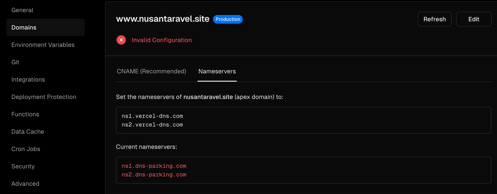

# Website Nusantaravel

Situs untuk agensi perjalanan domestik khusus untuk destinasi wisata di indonesia.
Situs dideploy di Versel dan dapat diakses pada [nusantaravel.site](http://nusantaravel.site).

## Preview

## Content

- Pilihan lokasi tujuan wisata
- Pilihan durasi wisata
- Form

## Versel Sign Up and Connect to GitHub Process

1. Buka [Situs Versel](https://vercel.com/)
2. Klik "Sign Up" dan pilih metode GitHub 
3. Pada menu "Overview" pilih "Import Project" 
4. Pada Import Git Repository pilih "Add GitHub Account" 
5. Pilih akun pribadi 
6. Pilih Repository yang telah di fork dan klik "install" 
7. Untuk mendeploy project pilih repository yang sudah di fork 
8. Klik "Deploy" 
9. Selesai

## Getting Domain and Connecting to Versel

1. Kunjungi [Website Niagahoster](https://niagahoster.co.id/) dan sign up
2. Ke menu Domain, insert nama domain yang diinginkan 
3. Dari beberapa domain suggestions yang muncul klik "beli domain" pada nama domain yang dipilih 
4. Selesaikan pembayaran
5. Pada menu "Domain", pilih "DNS/Nameserver" kemudian klik "DNS record", lalu pilih "Ganti namaserver" 
6. Buka situs versel dan log in 
7. Buka project yang sudah di deploy di versel kemudian klik menu "Domain" 
8. Ketik nama domain yang telah dibeli di niagahoster kemudian klik "Add" 
9. Pada menu "Nameservers" copy 2 nameservers 
10. Kembali ke situs niagahoster, ganti Nameserver dengan yang telah dicopy dari situs versel. Tunggu beberapa saat untuk menyelesaikan. 

## Deployment Link

[def]: <Screenshot 2024-06-28 at 23.20.32.png>
